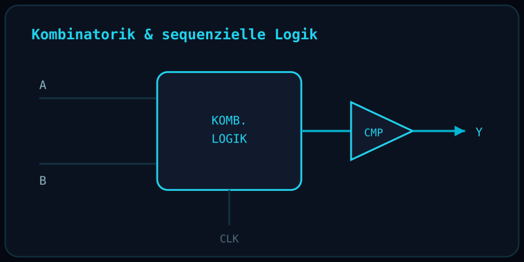

# Combinational & Sequential Circuit Design

  

> **Status note:** This repository is currently **documentation of completed coursework**, not a published source-code/schematic-file project. The original circuit designs were completed for a university digital electronics module (Hochschule Hannover) and the schematic files are not yet uploaded here. This README describes the project honestly based on the actual work completed.

## Overview

Design, optimization, and testing of digital circuits combining combinational and sequential logic, including comparator circuits.

## Objective

Deepen the fundamentals of digital circuit design along with systematic optimization and verification of logic circuits.

## Technologies

| Category | Tools |
|---|---|
| Logic Design | Truth tables, Karnaugh maps |
| Circuit Tools | Schematic design/simulation tools |

## Technical Concepts

- Combinational and sequential logic
- Comparator circuits
- Logic minimization (Karnaugh maps)
- Circuit verification

## Approach

1. Formulate requirements as a truth table.
2. Derive minimized logic expressions.
3. Implement as a schematic.
4. Functionally verify and test the circuit.

## Challenges

- Systematic logic minimization for more complex truth tables.
- Ensuring correct behavior of sequential elements across all input combinations.

## Skills Demonstrated

- Digital circuit design
- Logic optimization
- Structured verification and test methodology

## Possible Extensions

- Port the design to an FPGA implementation.
- Extend to more complex arithmetic or sequential building blocks.

## License

MIT — see [LICENSE](LICENSE).

## Author

**Abdellatif Ali** — B.Sc. Elektro- und Informationstechnik, Hochschule Hannover
[LinkedIn](https://linkedin.com/in/abdellatif-ali-b34295362)
